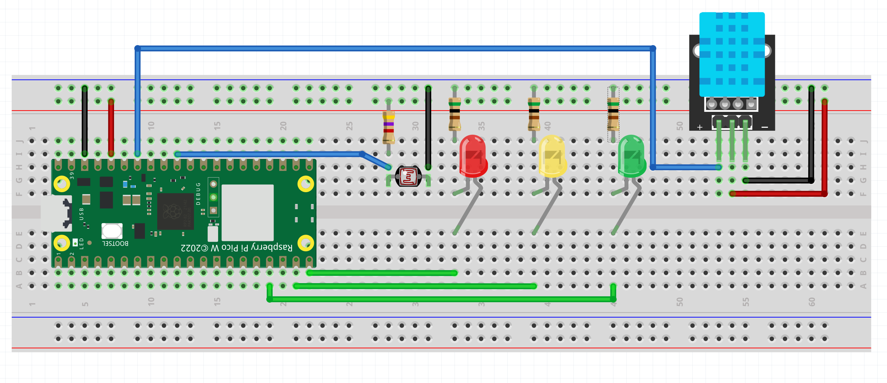
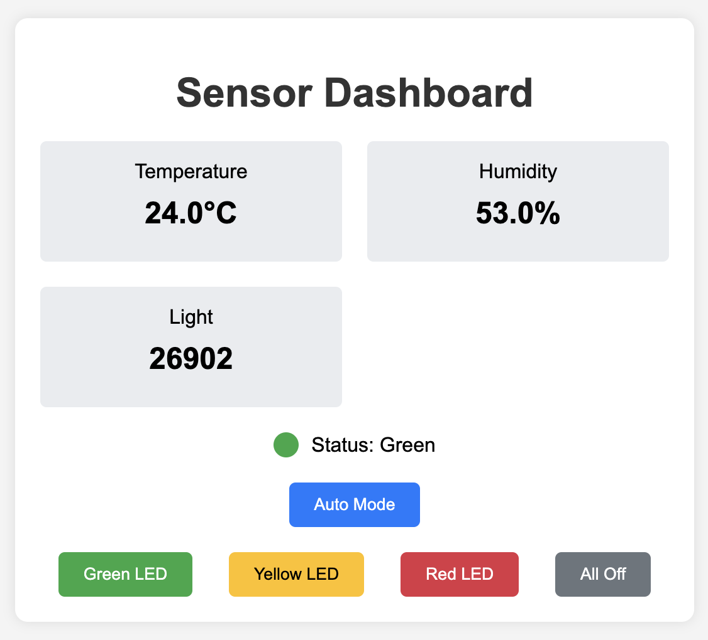
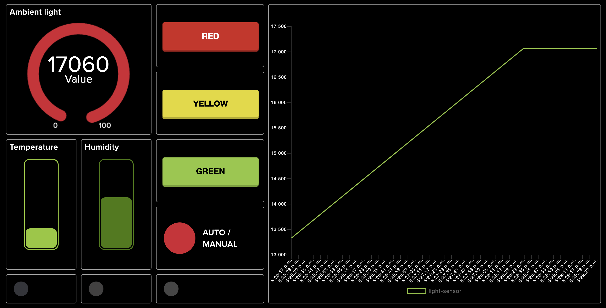
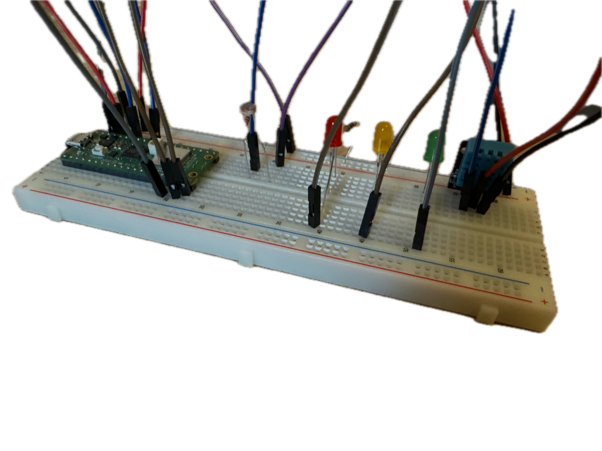

# Home Environment Monitoring System

**Ismail Safwat** (ss226ru)

## Project Overview

This project guides you through building a Home Environment Monitoring System using a Raspberry Pi Pico WH. The system measures and displays temperature, humidity, and light levels in a room or multiple rooms. It provides real-time data through a web interface and uses LEDs for visual status indication.

I've developed three variants of this system:
1. The main project version for real-world deployment
2. A simulation-capable version for testing and demonstration purposes
3. Adafruit IO using MQTT, including a Discord webhook for notifications.

**Estimated Time:** 20 mins for basic setup, additional time for exploring all variants

## Objective

I chose to build this Home Environment Monitoring System because I wanted to create something practical that could help make my living space more comfortable while also learning about IoT technology. The main idea was to keep an eye on the temperature, humidity, and light levels in my room without having to constantly check them myself.

By monitoring these factors, I hoped to get a better sense of when I might need to adjust my thermostat, open a window for some fresh air, or maybe even invest in a dehumidifier. The light sensor was added to help me be more mindful of my energy use – if there's plenty of natural light, maybe I don't need to flip on that light switch.

Another big part of why I chose this project was simply to get hands-on experience with IoT and home automation. It's one thing to read about these technologies, but actually building something and seeing it work is a whole different story. I figured this project would be a great way to learn about sensors, microcontrollers, and how to make them all work together.

I also thought it would be fun to add a simulation feature to the project. This way, I could test out how the system would react to different environmental conditions without having to actually create those conditions in my room. Plus, it makes for a cool demo to show friends and family how the system works without waiting for the actual temperature to change.

In the end, while this project might not revolutionize home living, I hope it will give me some useful insights into my home environment and serve as a stepping stone for future, more complex IoT projects. And who knows? Maybe it'll help me save a bit on my energy bill too!

## Materials

All components for this project were purchased as part of the [LNU Starter Kit from Electrokit](https://www.electrokit.com/lnu-starter). This kit provides all the necessary components for building various IoT projects, including our Home Environment Monitoring System.
Below is a detailed list of the materials used in this project, along with their specifications and purposes:

| Component | Specifications | Purpose |
|-----------|----------------|---------|
| Raspberry Pi Pico WH | - RP2040 microcontroller<br>- Dual-core ARM Cortex-M0+<br>- 264KB RAM, 2MB Flash<br>- Built-in WiFi | Main controller for the project. Processes sensor data, controls LEDs, and manages WiFi communication. |
| Breadboard | - 840 connection points | Allows for easy prototyping and connection of components without soldering. |
| USB Cable | - USB A male to micro B 5p male<br>- 1.8m length | Connects Raspberry Pi Pico to computer for programming and power. |
| Jumper Wires | - 30cm male to male | Connect components on the breadboard and to the Raspberry Pi Pico. |
| Resistors | - 3 x 560Ω (0.25W) for LEDs | Limit current for LEDs. |
| Red LED | - 5mm diffused<br>- 1500mcd brightness | Visual indicator for environmental conditions. |
| Yellow LED | - 5mm diffused<br>- 1500mcd brightness | Visual indicator for environmental conditions. |
| Green LED | - 5mm diffused<br>- 80mcd brightness | Visual indicator for environmental conditions. |
| Photoresistor (CdS) | - Resistance range: 4-7 kΩ | Measures ambient light levels in the room. |
| DHT11 Digital Temperature and Humidity Sensor | - Temperature and humidity sensor | Measures ambient temperature and relative humidity in the environment. |


These components work together to create a system that can monitor temperature, humidity, and light levels in your environment. The Raspberry Pi Pico processes the data from the sensors and controls the LEDs to provide a visual representation of the environmental conditions.

By using the LNU Starter Kit, we ensure that all components are compatible and readily available for the project. This kit provides an excellent foundation for learning about IoT and environmental monitoring.


## Computer Setup

1. Download and install [Thonny IDE](https://thonny.org/).
2. Connect Raspberry Pi Pico WH to your computer via USB.
3. In Thonny, go to "Run" > "Configure Interpreter" > "Interpreter" and select "MicroPython (Raspberry Pi Pico)".
4. Click on "Install or update firmware" to ensure you have the latest MicroPython firmware.

## Hardware Assembly

Connect the components as follows:

1. DHT11 Sensor:
   - VCC to 3.3V
   - GND to GND
   - DATA to GPIO 28
2. Photoresistor:
   - One leg to 3.3V
   - Other leg to GPIO 26 and to GND through a 4.7kΩ resistor
3. LEDs (each with a 500Ω resistor):
   - Green LED to GPIO 13
   - Yellow LED to GPIO 14
   - Red LED to GPIO 15



## Platform

This project explores three different platforms, each with its own characteristics and advantages:

1. **Local Web Server (Main Project Version)**
   - **Type**: Local installation
   - **Cost**: Free
   - **Features**:
     - Simplicity: Easy to set up and manage
     - Privacy: All data stays within the local network
     - Low Latency: Direct communication between device and browser
     - Cost-effective: No ongoing costs for cloud services
   - **Scalability**: Limited to local network; additional devices would require separate setups

2. **Simulation-Capable Platform**
   - **Type**: Local installation with flexibility for real or simulated data
   - **Cost**: Free
   - **Features**:
     - Dual Functionality: Can switch between simulated data and real sensor readings
     - Testing: Allows for testing various scenarios with or without physical sensors
     - Demonstration: Useful for showcasing system behavior under different conditions
     - Education: Helps in understanding system responses to various environmental states
     - Flexibility: Easy toggling between simulation and real-world operation
   - **Scalability**: Easily scalable for testing purposes; can also be used for real-world monitoring when using physical sensors

3. **Adafruit IO (Cloud-based Version)**
   - **Type**: Cloud platform
   - **Cost**: Free tier available, paid subscriptions for advanced features
   - **Features**:
     - Remote Access: Monitor and control from anywhere
     - Data Visualization: Built-in tools for data analysis and display
     - Integration: Easy to connect with other services (e.g., Discord webhooks)
     - Scalability: Can handle multiple devices and larger data sets
   - **Scalability**: Highly scalable; can easily add more devices or expand to multiple locations

### Comparison and Future Scaling:

- The local web server offers the most privacy and lowest latency but is limited in scalability and remote access.
- The simulation-capable platform provides a versatile environment for both testing and real-world application. Its ability to switch between simulated and real data makes it invaluable for development, testing, and gradual deployment.
- Adafruit IO provides the most comprehensive solution for scaling and remote management but introduces dependency on a third-party service and potential costs for advanced features.

For scaling the project:
1. **Local Version**: Could be expanded by setting up a central server within the local network to aggregate data from multiple Pico devices.
2. **Simulation-Capable Version**: Can be scaled for extensive testing scenarios and also supports real-world scaling when using physical sensors.
3. **Cloud Version**: Easily scalable by adding more devices and upgrading the Adafruit IO subscription as needed.

The choice of platform depends on specific needs:
- For a simple home project prioritizing privacy, the local version is ideal.
- For development, testing, and flexible deployment, the simulation-capable version offers the best balance.
- For a scalable, remotely accessible solution, the Adafruit IO version offers the most potential for growth.

Each platform offers unique functionalities, from basic monitoring to advanced data analysis and remote control, catering to different use cases and scalability requirements.

## Code Overview

These are three variants of the code:

### Main Project Version

The main project is now structured in a modular way, with separate files for different functionalities. Here's an overview of each file:

**`main.py`**

```python
from wifi_manager import connect_to_wifi
from sensor_manager import SensorManager
from led_manager import LEDManager
from web_server import start_server

def main():
    connect_to_wifi()
    sensor_manager = SensorManager()
    led_manager = LEDManager()
    start_server(sensor_manager, led_manager)

if __name__ == "__main__":
    main()
```

This is the entry point of the application. It initializes the WiFi connection, sensor manager, LED manager, and starts the web server.

**`led_manager.py`**
```python
import machine

class LEDManager:
    def __init__(self):
        # LED setup
        # ...

    def control_leds(self, temp, humid, light):
        # Automatic LED control logic
        # ...

    def set_led(self, color, state):
        # Manual LED control logic
        # ...

    def toggle_mode(self):
        # Toggle between manual and auto mode
        # ...
```

Manages the LED control, including automatic control based on sensor readings and manual control via web interface.

**`sensor_manager.py`**

```python
import machine
import dht

class SensorManager:
    def __init__(self):
        # Sensor setup
        # ...

    def read_sensors(self):
        # Read and return sensor data
        # ...
```
Handles the reading of temperature, humidity, and light sensors.

**`web_server.py`**

```python
import socket
from web_page import web_page
import time

def start_server(sensor_manager, led_manager, port=80):
    # Server setup and main loop
    # ...

def parse_request(request):
    # Parse incoming HTTP requests
    # ...

def handle_led_request(path, led_manager):
    # Handle LED control requests
    # ...
```

Implements the web server functionality, handling incoming requests and serving the web interface.

**`web_page.py`**

```python
def web_page(temp, humid, light, led_status, mode):
    # Generate HTML for the web interface
    # ...
```

Generates the HTML for the web dashboard, displaying sensor data and LED controls.

**`wifi_manager.py`**

```python
import network
from config import WIFI_SSID, WIFI_PASS

def connect_to_wifi():
    # WiFi connection logic
    # ...
```
Manages the WiFi connection.

### Key Features of the Main Project Version:

**Modular Structure:** The project is divided into separate modules for better organization and maintainability.

**Real-time Sensor Reading:** Reads actual data from the DHT11 sensor and photoresistor.

**Automatic and Manual LED Control:** LEDs can be controlled automatically based on sensor readings or manually through the web interface.

**Web Interface:** Provides a responsive web dashboard for monitoring sensor data and controlling LEDs.

**WiFi Connectivity:** Connects to a local WiFi network to make the dashboard accessible from other devices.

### Key Functions in the Main Project Version:

`connect_to_wifi()`
Establishes a connection to the specified Wi-Fi network, enabling remote access to the dashboard.

`read_sensors()`
Reads and returns the current temperature, humidity, and light levels from the physical sensors.

`control_leds(temp, humid, light)`
Sets the LED status based on the current sensor readings, indicating whether conditions are ideal, acceptable, or outside the desired range.

`web_page(temp, humid, light, led_status, mode)`
Generates the HTML for the web dashboard, displaying current sensor readings and LED status.

`parse_request(request)`
Parses incoming HTTP requests to handle user interactions with the web dashboard.

`handle_led_request(path)`
Processes requests to manually control the LEDs through the web interface.

`toggle_mode()`
Switches between automatic and manual LED control modes.

`start_server(port=80)`
Initializes and runs the web server, handling incoming connections and serving the dashboard.

## Simulation-Capable Version
This version includes additional features for testing and demonstration, with the ability to switch between simulated and real sensor data:

```python
import machine
import dht
import time
import random

# [Sensor and LED setup remains the same]

# Define threshold values
temp_ideal_range = (20, 25)
humid_ideal_range = (40, 60)
light_ideal_range = (20000, 40000)

# Define warning ranges
temp_warning_range = (18, 27)
humid_warning_range = (35, 65)
light_warning_range = (10000, 50000)

# Simulation flag
simulate = True

# Time-based light thresholds
daytime_light_range = (20000, 40000)
nighttime_light_range = (0, 5000)

def is_daytime():
    current_hour = time.localtime()[3]
    return 6 <= current_hour < 20

def get_light_thresholds():
    return daytime_light_range if is_daytime() else nighttime_light_range

def control_leds(temp, humid, light):
    # Enhanced LED control logic here
    pass

def simulate_values():
    # Simulation logic here
    pass

# Main loop with option to use real or simulated data
while True:
    try:
        if simulate:
            temp, humid, light = simulate_values()
        else:
            # Read from physical sensors
            dht_sensor.measure()
            temp = dht_sensor.temperature()
            humid = dht_sensor.humidity()
            light = photoresistor.read_u16()

        print(f"Temperature: {temp:.1f}°C, Humidity: {humid:.1f}%, Light: {light}")
        print(f"Current period: {'Daytime' if is_daytime() else 'Nighttime'}")

        # Control LEDs based on conditions
        led_status = control_leds(temp, humid, light)
        print(f"LED Status: {led_status}")

    except Exception as e:
        print(f"Error: {e}")

    time.sleep(2)  # Wait for 2 seconds before reading again
```
### Key Features of the Simulation-Capable Version:

**Dual Functionality:** Can switch between simulated data and real sensor readings using the simulate flag.
**Time-based Light Thresholds:** Adjusts light level expectations based on the time of day.
**Simulation Mode:** When active, generates mock sensor data for testing purposes.
**Enhanced LED Control:** The LED status is determined by more nuanced conditions, including time-of-day considerations for light levels.
**Error Handling:** The main loop includes exception handling to manage potential errors gracefully.

### Key Functions in the Simulation Version
`is_daytime()`
Determines if it's currently daytime (6 AM to 8 PM) based on the system's current hour.
`get_light_thresholds()`
Returns appropriate light level thresholds based on whether it's daytime or nighttime.
`control_leds(temp, humid, light)`
Sets the LED status based on how closely the current conditions match the ideal ranges, considering the time of day for light levels.
`simulate_values()`
When simulation mode is active, this function generates realistic mock data for temperature, humidity, and light levels.


## Adafruit IO and MQTT Version
This version integrates with Adafruit IO using MQTT for cloud-based data storage and control. Here's an overview of the key components:

```python
import time
from mqtt import MQTTClient
import machine
import micropython
from machine import Pin, ADC
import dht
import keys
import wifiConnection

# Sensor and LED setup
dht_sensor = dht.DHT11(Pin(28))
photoresistor = ADC(26)
led_green = Pin(13, Pin.OUT)
led_yellow = Pin(14, Pin.OUT)
led_red = Pin(15, Pin.OUT)

# Constants
SENSOR_INTERVAL = 30000
MANUAL_TIMEOUT = 300000
MODE_UPDATE_INTERVAL = 60000

# Global variables
manual_override = False
last_manual_control = 0
last_mode_update = 0

def connect_wifi():
    # WiFi connection logic here

def sub_cb(topic, msg):
    # MQTT subscription callback
    # Handles incoming messages for LED control

def update_mode_indicator():
    # Updates the mode (AUTO/MANUAL) on Adafruit IO

def update_led_indicators():
    # Updates individual LED status on Adafruit IO

def manual_control_leds(command):
    # Handles manual LED control from Adafruit IO

def auto_control_leds(temp, humid, light):
    # Automatic LED control based on sensor readings

def read_sensors():
    # Reads data from DHT11 and photoresistor

def send_sensor_data():
    # Sends sensor data to Adafruit IO

# Main execution
client = MQTTClient(keys.AIO_CLIENT_ID, keys.AIO_SERVER, keys.AIO_PORT, keys.AIO_USER, keys.AIO_KEY)
client.set_callback(sub_cb)
client.connect()
client.subscribe(keys.AIO_LED_CONTROL_FEED)

while True:
    client.check_msg()
    send_sensor_data()
    update_mode_indicator()
    time.sleep(1)

```

### Key Features of the Adafruit IO and MQTT Version:

- **Cloud-Based Data Storage:** Sensor data is sent to Adafruit IO, allowing for long-term data storage and access from anywhere.
- **MQTT Communication:** Uses the MQTT protocol for efficient, real-time data transmission.
- **Remote LED Control:** LEDs can be controlled remotely through the Adafruit IO dashboard.
- **Mode Indicator:** Displays whether the system is in automatic or manual control mode.
- **Discord Notifications:** Sends alerts and updates to a Discord channel via webhook.

### Setup for Adafruit IO and MQTT Version:

**1.** Create an Adafruit IO account and note your username and AIO key.
**2.** Set up the following feeds in Adafruit IO:

- Temperature
- Humidity
- Light level
- LED control
- Mode indicator
- Green LED indicator
- Yellow LED indicator
- Red LED indicator


**3.** Create a Discord webhook URL for your desired channel.

**4.** Update the keys.py file with your Adafruit IO and Discord credentials.

### Key Functions in the Adafruit IO and MQTT Version:
`connect_wifi()`
Connects the Pico to your local WiFi network.

`send_to_adafruit(client, temp, humid, light)`
Publishes sensor data to Adafruit IO using MQTT.

`send_to_discord(temp, humid, light)`
Sends sensor data as a message to your Discord channel.

`update_mode_indicator()`
Updates the mode (AUTO/MANUAL) on the Adafruit IO dashboard.

`update_led_indicators()`
Updates the individual LED status indicators on the Adafruit IO dashboard.

`manual_control_leds(command)`
Handles manual LED control commands received from Adafruit IO.


## Choosing Between Versions:

- Use the main project version for local monitoring and control without internet dependency.
- Use the simulation-capable version for testing and demonstration purposes.
- Use the Adafruit IO and MQTT version for cloud-based monitoring, remote control, and advanced data analysis.

This Adafruit IO and MQTT integration represents a significant enhancement to the project, allowing for more sophisticated data handling, remote access, and expandability. It demonstrates how a simple local project can be scaled up to a full-fledged IoT solution with cloud integration and instant messaging capabilities.

To use the simulation version, replace the main code with this variant and set the `simulate` flag to `True` when you want to run in simulation mode.

## Transmitting the Data / Connectivity

This project has three variants, each with its own approach to data transmission and connectivity:

1. **Main Project Version (Local Web Server)**
   - **Wireless Protocol:** Wi-Fi (client mode)
   - **Transport Protocol:** HTTP
   - **Frequency:** Auto-refreshes every 5 seconds
   - **Data Flow:** Sensor data is read locally and served through a web server hosted on the Raspberry Pi Pico WH.

2. **Simulation-Capable Version**
   - **Data Source:** Can switch between simulated data and real sensor readings
   - **Wireless Protocol:** Wi-Fi (client mode)
   - **Transport Protocol:** HTTP
   - **Frequency:** Updates every 2 seconds (configurable)
   - **Data Flow:** 
     - When using real sensors: Data is read from physical sensors
     - When simulating: Data is generated locally
   - Uses the same web server setup as the main version
   - Allows testing of various environmental conditions with or without physical sensors

3. **Adafruit IO and MQTT Version**
   - **Wireless Protocol:** Wi-Fi (client mode)
   - **Transport Protocol:** MQTT
   - **Frequency:** Configurable, typically every 30-60 seconds
   - **Data Flow:** Sensor data is sent to Adafruit IO cloud platform for storage and visualization

### Design Choices and Their Impact

- **Wi-Fi Usage:** Offers good range within a home environment and allows for easy integration with existing networks. However, it consumes more power compared to low-power protocols like LoRa.
- **HTTP vs MQTT:**
  - HTTP (Main Version): Simple to implement, good for local network usage, but less efficient for frequent updates.
  - MQTT (Adafruit Version): Lightweight, efficient for frequent small data transmissions, ideal for IoT applications.
- **Transmission Frequency:** The 5-second refresh rate in the main version provides near real-time data but may impact battery life if running on batteries. The Adafruit version's adjustable frequency allows for balancing between data freshness and power consumption.

## Presenting the Data

1. **Main Project and Simulation Versions**
   - **Dashboard:** Responsive web interface hosted locally on the Raspberry Pi Pico WH
   - **Refresh Rate:** Auto-refreshes every 5 seconds
   - **Display:** Shows current temperature, humidity, and light levels
   - **Controls:** Offers manual LED control
   - **Data Storage:** No long-term storage; data is read and displayed in real-time
   - **Simulation Feature:** Indicates "Daytime" or "Nighttime" in the simulation version

2. **Adafruit IO Version**
   - **Dashboard:** Customizable dashboard on Adafruit IO platform
   - **Display:** Shows real-time and historical data for temperature, humidity, and light levels
   - **Controls:** Offers remote LED control and mode switching (AUTO/MANUAL)
   - **Data Storage:** Data is stored in Adafruit IO's cloud database
   - **Storage Duration:** Depends on the Adafruit IO plan (Free plan stores data for 30 days)
   - **Automation:** Adafruit IO allows setting up triggers and alerts based on sensor data

### Dashboard Visuals

*Local web dashboard for main and simulation versions*


*Adafruit IO dashboard*

### Database Choice
- **Local Versions:** No database used; real-time data only
- **Adafruit IO Version:** Uses Adafruit's cloud database, offering easy setup, visualization tools, and integration with other services

## Finalizing the Design

### Final Results
This project successfully demonstrates a functional home environment monitoring system with three distinct variants:
1. A local web server-based system for direct monitoring
2. A simulation-capable version for testing and demonstration
3. A cloud-connected version using Adafruit IO for remote monitoring and control


*Physical setup of the Home Environment Monitoring System*

### Final Thoughts and Potential Improvements
1. **Versatility:** The three variants offer flexibility for different use cases, from local monitoring to cloud-based IoT applications.
2. **Learning Experience:** This project provided valuable hands-on experience with sensors, microcontrollers, web development, and cloud IoT platforms.
3. **Power Efficiency:** Future iterations could explore lower-power wireless protocols for better battery life in portable applications.
4. **Data Analysis:** Implementing long-term data storage and trend analysis could provide more valuable insights.
5. **Sensor Expansion:** Adding more sensors (e.g., air quality, pressure) could provide a more comprehensive environmental picture.

This project demonstrates the potential of DIY IoT solutions for home monitoring and automation. It offers insights into living environments while serving as an excellent learning platform for IoT technologies, from local implementations to cloud-based systems.
